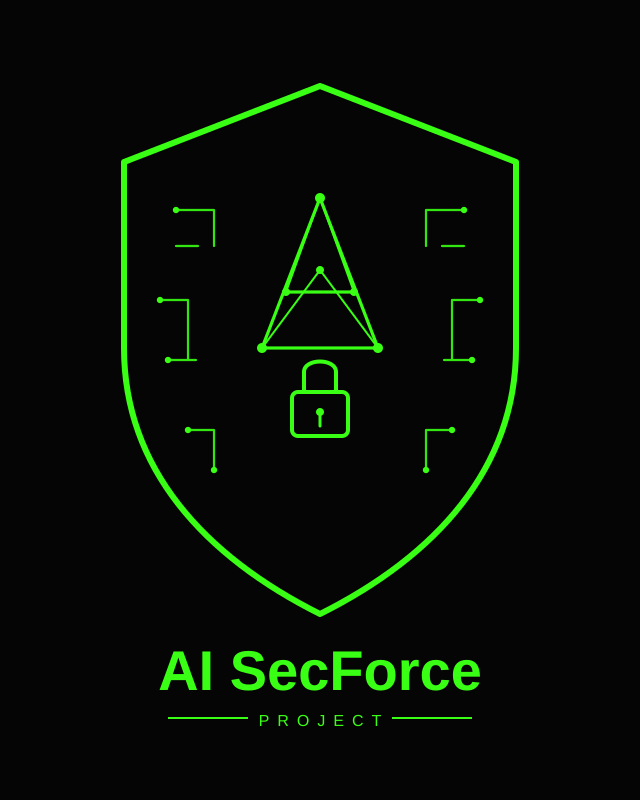
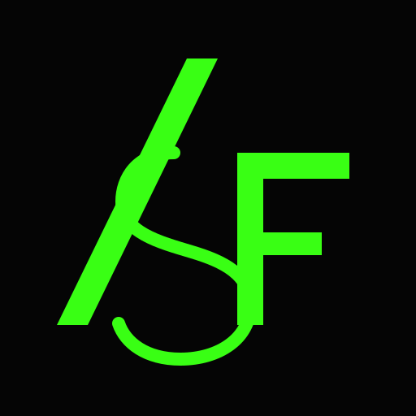

# AI SecForce

**aisecforce.online** · **aisecforce.ru**

Практический проект на стыке **AI** и **инфраструктурной безопасности**: изоляция сети, аномалии трафика, то, что видно с гостя и то, что хостер не показывает.

Сайт пока в разработке. Этот репозиторий — бренд, ассеты и точка сборки проекта.

## Логотипы

Цвета заглушки: фон `#050505`, фосфор `#39FF14`.

| Файл | Назначение |
|---|---|
| [brand/aisecforce-emblem-shield.svg](brand/aisecforce-emblem-shield.svg) | Основной знак для заглушки: щит + нейросеть + замок |
| [brand/aisecforce-emblem-eye.svg](brand/aisecforce-emblem-eye.svg) | Вариант «сенсор»: гекс + радар-глаз |
| [brand/aisecforce-monogram-asf.svg](brand/aisecforce-monogram-asf.svg) | Монограмма ASF — фавикон, аватар |
| [brand/aisecforce-lockup-horizontal.svg](brand/aisecforce-lockup-horizontal.svg) | Горизонтальный lockup для шапки |
| [brand/raster/](brand/raster/) | Растровые исходники (JPG) |

### Основной знак

### Монограмма

## Ссылки

- https://aisecforce.online
- https://aisecforce.ru
- https://github.com/cuthbertnogood/aisecforce
